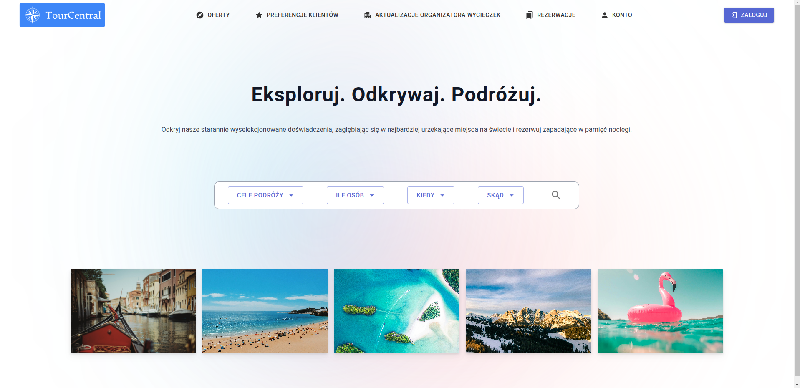
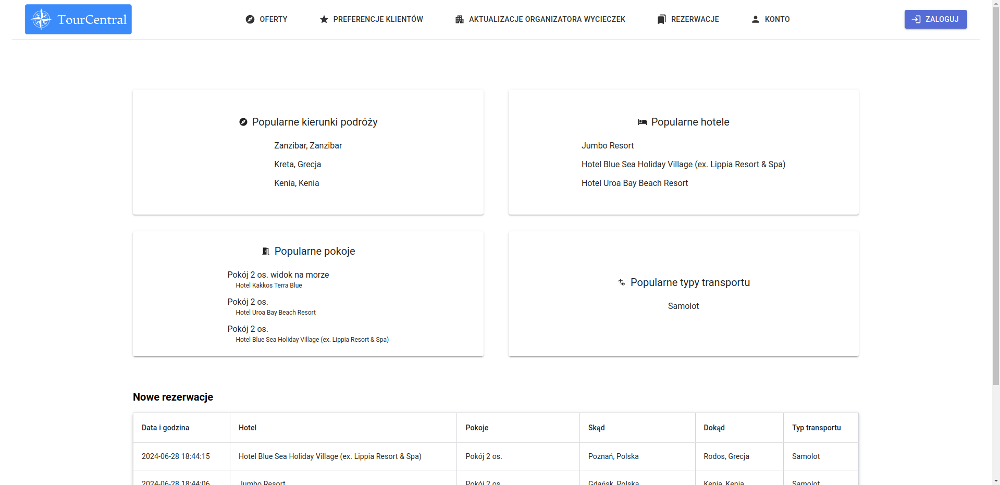
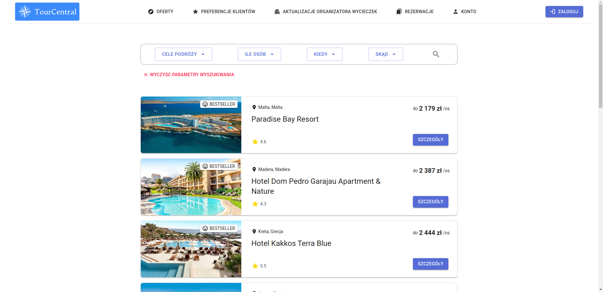
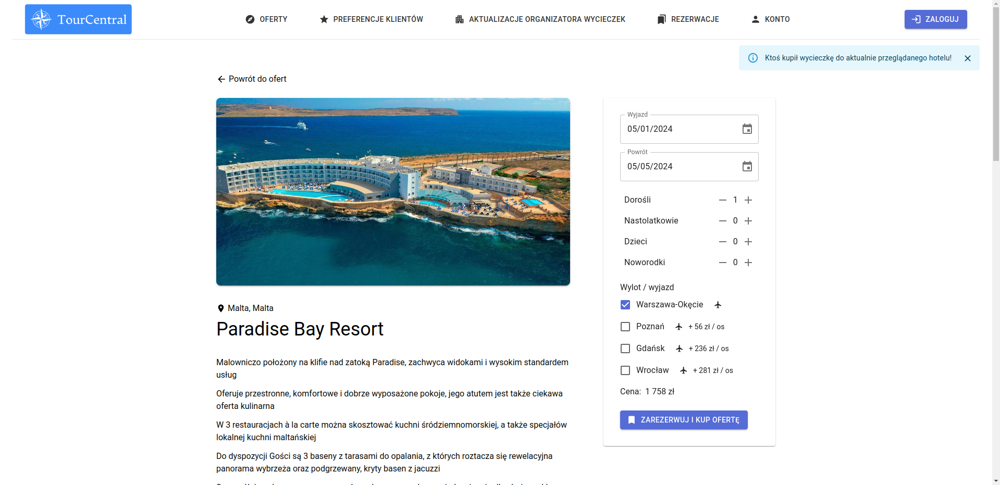
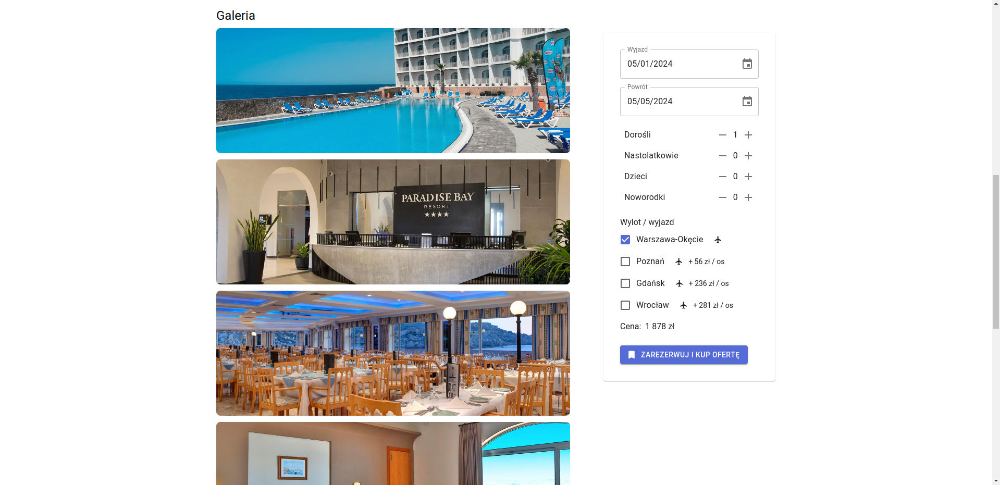
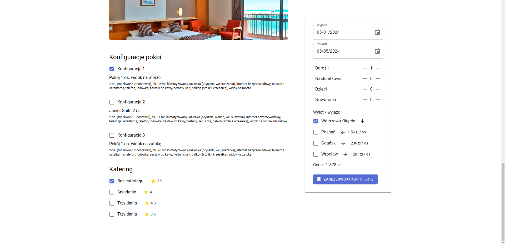
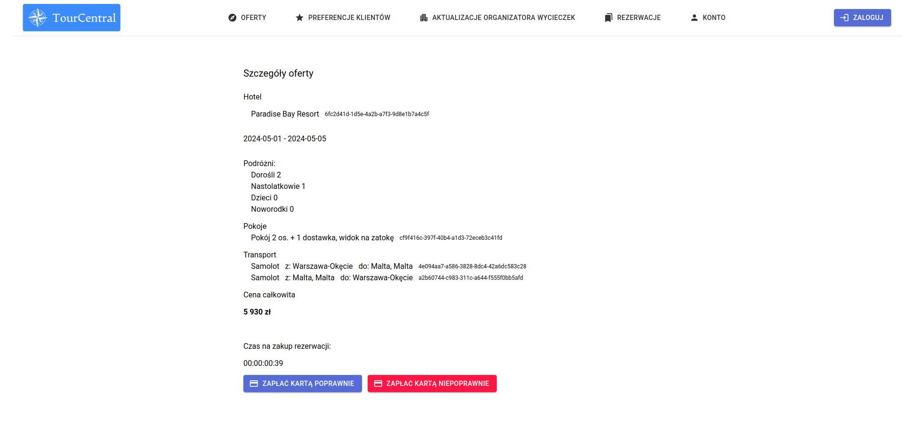

# Travel agency frontend

This is a frontend for travel agency application based on microservices architecture
which can be found [here](https://github.com/Microarchitecturovisco/travel-api). 
The app is written in TypeScript.


## Table of contents
- [Description](#description)
- [Setup](#setup)
- [Available Scripts](#available-scripts)
## Description

### Home Page
This is the home page, where you can search for trips depending on your choise (destinations, numer of people, dates and departure places). 
<div align="center">
  
</div>

### Clients Preferences
You can easly switch to view with preferences of clients, where you can see which destinations, rooms, hotels, and transport types are most popular. You can also check information about last reservation to find an inspiration. This view is update in real time with usage of websockets.
<div align="center">
  
</div>

### Available Offers
After you hit the search button, you will see Hotels which satisfie choosen parameters. From this view you also check hotel price and hotel rate.
<div align="center">
  
</div>

### Offer details

From previous view you can choose a Hotel to see its details. Here you see all the details of the hotel such as: description, photos, available rooms configurations with descriptions and catering options. You can change room configuration, catering option, departure place and number of guests. Each change will result in automatic price change. Additionally, if someone buys an offer with hotel you are viewing, you will see a popup in top right corner with this information. It is made with websocket usage. You can see the popup on photo below. 

<div align="center">
  
</div>
<div align="center">
  
</div>
<div align="center">
  
</div>

### Reservation
When you decide to purchase an offer you will see view with details of the trip. Here you can reserve an offer for 1 minute, during which you can decide to pay for an offer or decline it.

<div align="center">
  
</div>

## Setup

### Node

Node.js version `> 19` is required

### Download dependencies

```shell
corepack enable
```

```shell
yarn
```

This project uses a modern version of `yarn` for package management

### API host and port

Configure the API connection in the `.env` file

## Available Scripts

In the project directory, you can run:

### `yarn start`

Runs the app in the development mode.\
Open [http://localhost:3000](http://localhost:3000) to view it in your browser.

The page will reload when you make changes.\
You may also see any lint errors in the console.

### `npm test`

Launches the test runner in the interactive watch mode.\
See the section about [running tests](https://facebook.github.io/create-react-app/docs/running-tests) for more information.

### `yarn run build`

Builds the app for production to the `build` folder.\
It correctly bundles React in production mode and optimizes the build for the best performance.

The build is minified and the filenames include the hashes.\
Your app is ready to be deployed!

See the section about [deployment](https://facebook.github.io/create-react-app/docs/deployment) for more information.

### `yarn run eject`

**Note: this is a one-way operation. Once you `eject`, you can't go back!**

If you aren't satisfied with the build tool and configuration choices, you can `eject` at any time. This command will remove the single build dependency from your project.

Instead, it will copy all the configuration files and the transitive dependencies (webpack, Babel, ESLint, etc) right into your project so you have full control over them. All of the commands except `eject` will still work, but they will point to the copied scripts so you can tweak them. At this point you're on your own.

You don't have to ever use `eject`. The curated feature set is suitable for small and middle deployments, and you shouldn't feel obligated to use this feature. However we understand that this tool wouldn't be useful if you couldn't customize it when you are ready for it.
